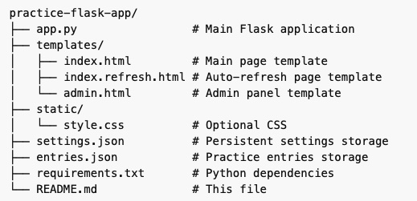
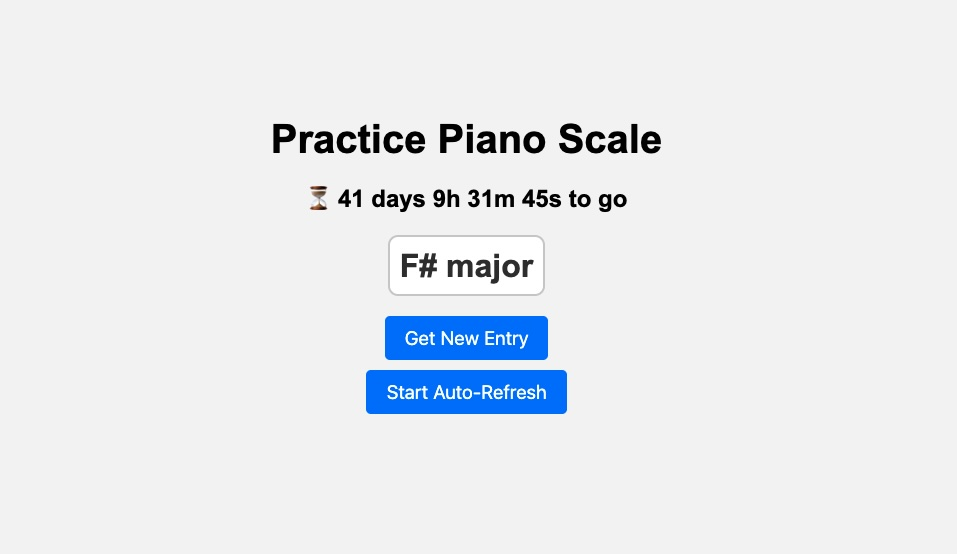
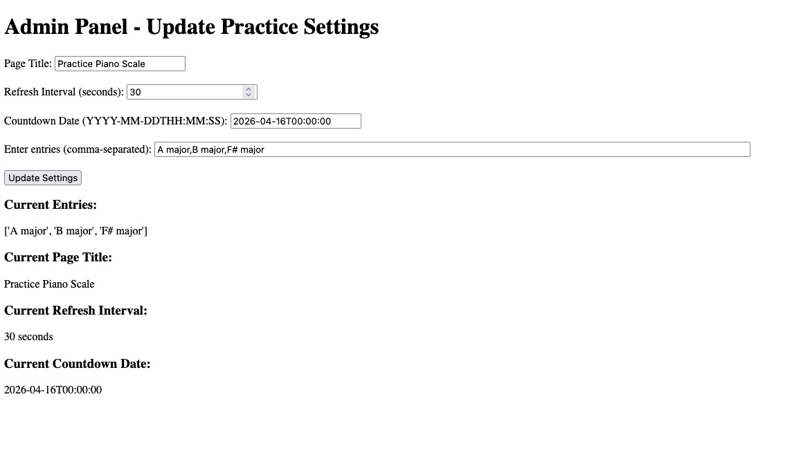

# Practice

This script idea came from my daughter, who is preparing for her piano exam. She asked me to help her practice scales by reading out scale names, e.g., "A major" or "D major arpeggio left hand," in sequence so she could practice them. I thought it would be more fun and efficient to automate this process. With this lightweight Flask app, she can use just a phone or iPad to follow randomized exercises and practice independently.

Generally this has become a lightweight Flask app for practicing various skills such as piano scale exercises, quizzes, or custom activities. Admins can manage entries, page titles, countdown, and auto-refresh intervals.

## Features

- Randomly display practice entries
- Admin panel to:
  - Add or update entries
  - Change page title
  - Set countdown date
  - Set auto-refresh interval
- Countdown timer to a configurable date
- Auto-refresh page for continuous practice
- **Persistent settings**: all changes made in the admin panel are saved to `settings.json` and survive server restarts

## Installation

1. Clone the repository:

    ```bash
    git clone https://github.com/yourusername/practice.git
    cd practice
    ```

2. Create a virtual environment:

    ```bash
    python3 -m venv venv
    source venv/bin/activate   # Linux/Mac
    venv\Scripts\activate      # Windows
    ```

3. Install dependencies:

    ```bash
    pip install Flask
    ```

4. Ensure a `settings.json` file exists in the project folder. Example:

    ```json
    {
        "entries": ["A major", "E major", "B major"],
        "page_title": "Practice",
        "refresh_interval": 30,
        "countdown_date": "2026-04-16T00:00:00"
    }
    ```

> Tip: If the file does not exist, the app will create it automatically with default values.

5. Run the app:

    ```bash
    python app.py
    ```

> Note: The app is configured for HTTP by default. Update and uncomment `ssl_context` in `app.py` with your certificates, or remove it for HTTP testing.

6. Access the app:

- Practice page: `https://localhost:5001/`
- Admin page: `https://localhost:5001/admin`

## Usage

- Use the **Admin Panel** to:
  - Add or update practice entries
  - Set a custom page title
  - Set countdown date (format: `YYYY-MM-DDTHH:MM:SS`)
  - Adjust auto-refresh interval
- The practice page will display a random entry and can auto-refresh at the specified interval.
- All settings are saved to `settings.json` and remain after server restarts.

## Customization

- Change page title for different activities like "Piano Practice" or "Quiz Practice".
- Adjust countdown date for any event.
- Adjust the auto-refresh interval (in seconds) for timed exercises.
- Entries are comma-separated strings.
- Add SSL cert, uncomment the last segment of `ssl_context` in `app.py` and point the SSL cert pem file. SSL cert generation beyond this guide. 

## File Structure



## Sample Run

Script run


Admin panel



## License

MIT License
